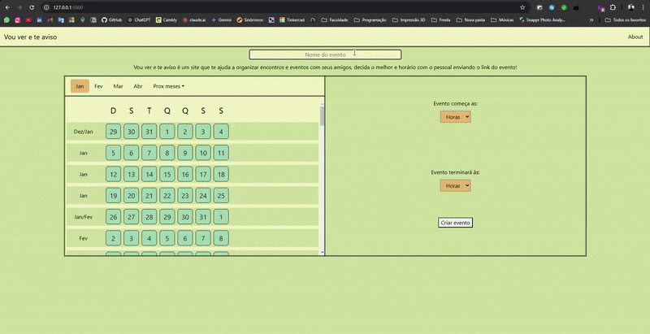

# Vou ver e te aviso
#### Video Demo: [https://youtu.be/N0n-fbSYNiw](https://youtu.be/N0n-fbSYNiw)
#### Descrição:
Agende um evento com seus amigos! O sistema atualiza em tempo real, e você pode criar quantos eventos você quiser! VouVerTeAviso é uma aplicação web que permite aos usuários criar eventos e marcar horários disponíveis para esses eventos. Os usuários podem visualizar horários disponíveis e indisponíveis, além de adicionar seus próprios horários disponíveis.



## Funcionalidades
 - Criar eventos com nome, hora inicial e final
 - Marcar horários disponíveis para os usuários.
 - Visualizar horários disponíveis e indisponíveis.
 - Dados armazenados em todos os instantes.

## Tecnologias

```
Python
Flask
SQLite
HTML/CSS
JavaScript
```

## ⚙ Executando a aplicação
1. **Copie os arquivos para sua máquina: `https://github.com/GabrielGRR/VouVerTeAviso.git`**
2. **Navegue até a pasta**: `cd project`
3. **Execute o programa**: `flask run`

## Estrutura dos arquivos
```
VouVerTeAviso/
├── app.py                # Main application file
├── calendar_logic.py     # Helper file
├── Static/
│   └── event.js          # JS for event.html
│   └── index.js          # JS for index.html
│   └── style.css         # styles for both html
├── templates/
│   └── event.html        # Event page
│   └── index.html        # Register event page
└── events_db.db          # App DataBase
```

## Uso
- Crie um evento na página inicial.
- Compartilhe a URL com seus amigos.
- Cada amigo adiciona seus respectivos horários disponíveis.
- Decidam o melhor dia e horário para se reunir!

### Melhorias Futuras
- Adicionar validações no frontend para evitar seleções conflitantes.
- Melhorar a acessibilidade para usuários com necessidades especiais.
- Implementar testes para validar cálculos de cores e lógica de distribuição.
- Corrigir possíveis bugs quando um evento começa em um dia x e termina no dia x+1.
